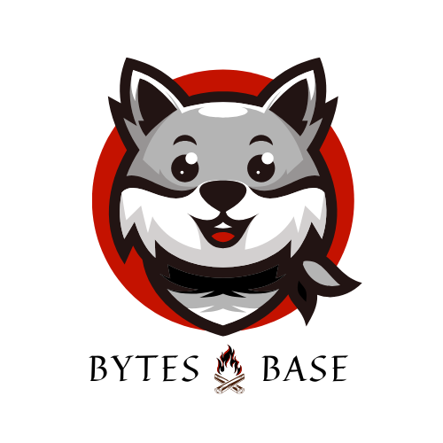

   

  <h3> Bytes Base - Tech. Community Platform</h3>

<a href="https://www.linkedin.com/company/bytes-base">
  

  

---
**Welcome to Bytes Base**

Bytes Base is an AI assisted developer community platform built for universities and colleges, empowering students, alumni and faculty to collaborate and grow together. The platform enables users to showcase builds, share technical knowledge/resources , explore content, connect with fellow contributors, participate in Q&A. The goal is to make everyone in the community learn, understand, and grow together.

**The Problem**

Many institutions have talented student developers, but meaningful interaction and collaboration often remain limited to classrooms, clubs, or short-term events. Being good academically is important for every individual, but industry expectations around skills and practical knowledge are different. This gap still needs to be addressed at the institutional level.

**How It Works?**

Each institution receives its own dedicated community space where contributors can publish content across organized domains, members can explore content with AI assisted support,  join communities, engage in discussions, collaborate with peers, receive announcements and discover fellow developers across campus. Administrators gain visibility into platform insights, community engagement and contributor activity while maintaining a secure, well-managed and organized environment.

**Why Bytes Base?**

Bytes Base helps institutions cultivate an active technical community by encouraging students to share knowledge, collaborate on ideas, engage with peers and learn from one another. The platform transforms isolated contributors into a connected ecosystem where innovation, participation and community-driven learning can thrive.

**How to Launch?**

Visit https://www.bytesbase.me book a demo session. Our team will schedule a personalized walkthrough to showcase the platform and its features. Institutions will receive one month of complimentary access to explore the platform within their campus environment. Upon confirmation, We provide onboarding and launch support.

---

## Key Features

* **User Authentication** –Secure registration and login with role-based access using JWT.
* [**Assistant_Knowledge Hub**](https://github.com/YUGESHKARAN/Assistant_Knowledge_Hub) – In-post AI assistant that provides contextual explanations, related posts, videos, and suggest follow-up queries.
* [**DraftMate AI**](https://github.com/YUGESHKARAN/blogChat-backend) – Content drafting assistant to refine and structure post descriptions before publishing.
* **Post Management** – Create, edit, and publish technical posts within the community.
* **Playlists Management** – Organize and save curated collections of posts for structured learning.
* [**Discussions**](https://github.com/YUGESHKARAN/Tech-Discussion.io.git) – Engage with the community through threaded discussions on posts.
* **Announcements** – Coordinators and admins can publish institutional or community updates.
* **Notifications** – Real-time alerts for recommended feeds and comments.
* [**Network Recommendation**](https://github.com/YUGESHKARAN/recommendation-system) – A graph structured author recommendation system to build connections.
---

## Student Interface

- **Explore Technical Content**: Browse, learn, and engage with posts across tech communities.
- **Interactive Discussions**: Comment on posts and join lively discussions.
- **Personalized Experience**: Follow favorite communities and authors, and receive tailored notifications.
- **Stay Informed**: Get real-time announcements about events and sessions.

## Coordinator Interface

- **Content Creation & Management**: Publish, edit, or delete technical posts.
- **AI-Powered Grammar Checker**: Ensure content quality using integrated AI tools.
- **Event Management**: Plan and schedule announcements for meetings and events.

## Admin Interface

- **Platform Oversight**: Manage users, roles, and permissions.
- **Activity Monitoring**: Verify and monitor student and coordinator activities.
- **Comprehensive Control**: Oversee and configure all aspects of the platform.

---

## Contributing

Contributions are welcome!  
Refere [CONTRIBUTING.md](CONTRIBUTING.md)

### License & Copyright

This software is Copyright (c) 2026 BytesBase.tech. All rights reserved. 

The open-source version of this application is licensed under the GNU Affero General Public License v3 (AGPLv3). See the [LICENSE](LICENSE) file for the full legal text. 

### B2B Commercial Licensing & Procurement

The AGPLv3 license ensures that modifications made to this software by the community are shared back openly. If your academic institution or university IT compliance team requires proprietary deployment, custom closed-source integrations, or terms that conflict with the AGPLv3 copyleft requirements, standard commercial B2B licenses are available. 

For enterprise procurement, custom service-level agreements (SLAs), or commercial licensing inquiries, please contact: **yugeshkaran01@gmail.com**.

---
